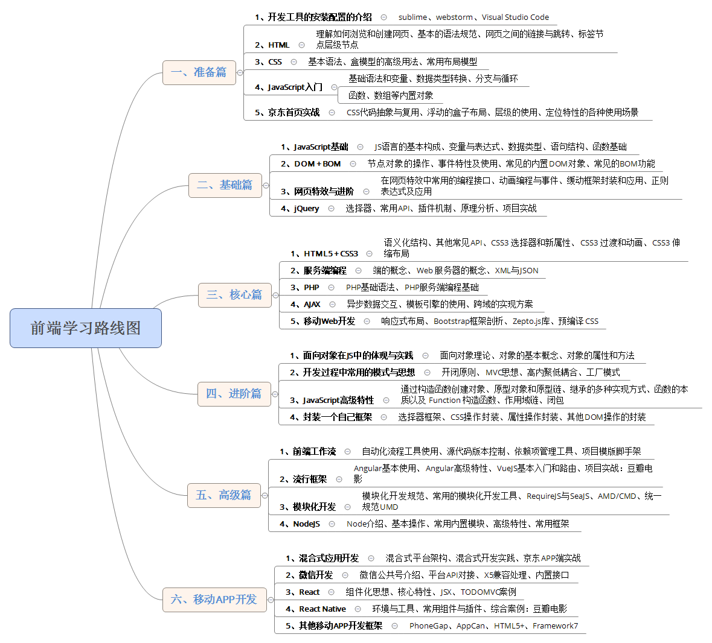

#### 前端学习线路图--致自己

### 基础篇（学习周期30天 2019.01.15 - 2019.02.17)
要做的事：
- javascript 基础 ：js内置对象的常用方法，变量，数据类型，表达式，选择结构，循环结构，函数基础，js基本特效（tab、导航、整页滚动、轮播图、JS制作幻灯片、弹出层、手风琴菜单、瀑布流布局、滚动事件、滚差视图）
- DOM + BOM ：DOM基本结构，节点对象的操作，时间特性及使用，常见的内置DOM对象，常见的BOM操作。
- 进阶： 网页特效，事件对象，正则表达式及其应用
- Jquery： 选择器，基本操作API，动画API，事件API，插件机制，原理分析，项目实战。

学完后的目标：
能够基于Jquery实现动态的效果和复杂的功能模块。熟练操作DOM原型。
div+css + jquery（js)实现一个小型的动态网站实例，结合 PHP + mongoDB （！！！不要好高骛远）
<!--MORE-->

### 核心篇